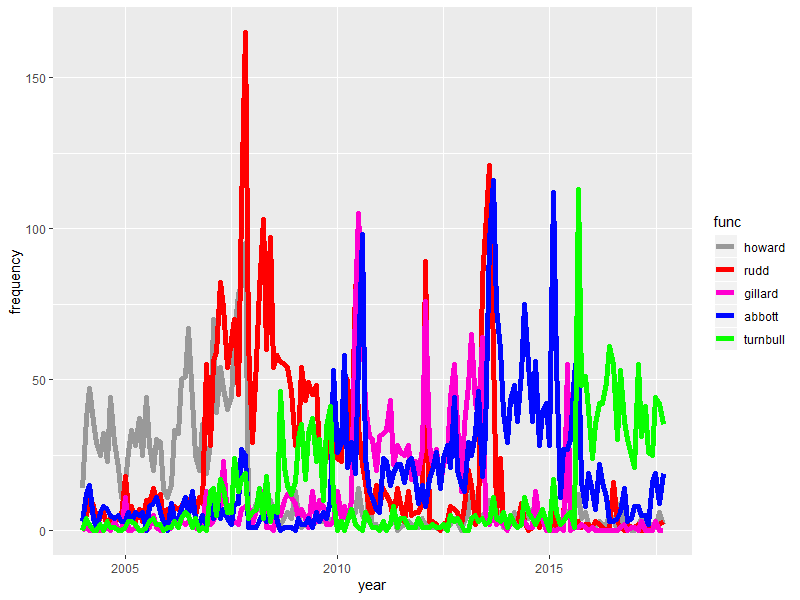

# News-Headlines-Analysis
I did this analysis two years ago, but really like playing around with the functions I wrote, especially the word frequency tracking plots. I guess it would be worth spending some time in speeding up the code, and avoiding the for-loops, but I did not have a lot of free time ultimately.
Analysis of all the news headlines between 2004 and 2016 of an Australian Newspaper, the dataset is from Kaggle and can be found [here](https://www.kaggle.com/therohk/million-headlines/data).

When I saw the dataset I tried out four different ideas.

### Count of most used words in a month
Can we see what happened in a given month by looking at the 10 most used words in the headlines?
The function topx calculates the top x most used words for a given month.

### Tracking and plotting word frequency throughout time
Can we see how often the last australian prime ministers were mentioned before, during and after their role as prime minister? In which months does the newspaper write about fires, when about gold?

### Wordcloud and Sentiments
Simple wordcloud of the most used words (I would not encourage to use it, as it has a very long runtime), as well as measuring the number of positive and negative headlines with the afinn sentiment tables.

### Country analysis
Plotting on a map how often countries across the world were mentioned in the australian newspaper.
